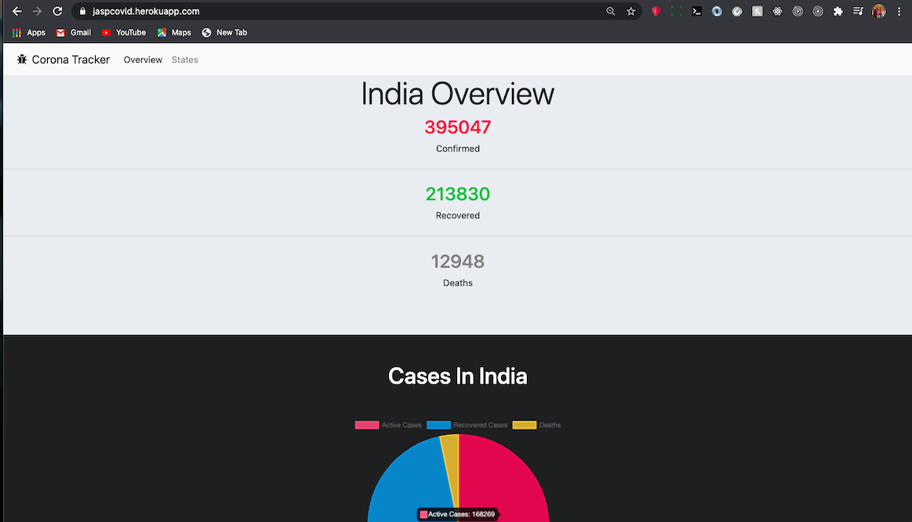

<!-- PROJECT LOGO -->
<br />
<p align="center">
  <a href="https://jaspcovid.herokuapp.com/
">
    
  </a>

   <h1 align="center">Covid Tracker</h1>
    <div align="center">
  <h4 >
 Track Covid Cases
  </h4>
  <p>
   This Corona Tracker website which displays the current corona cases all over India. The website is responsive which means it can be viewed on any device.

  </p>
    .
    <a href="https://github.com/Gautam-Arora24/Covid-Tracker/issues">Report Bug</a>
    ·
    <a href="https://github.com/Gautam-Arora24/Covid-Tracker/issues">Request Feature</a>
    .
    <a href="https://jaspcovid.herokuapp.com/">Try it </a>

</p>

<!-- ABOUT THE PROJECT -->

## About The Project

<!-- [![Product Name Screen Shot][product-screenshot]](https://example.com) -->

<p align ="center">



<p float ="right">


</p>
<!-- GETTING STARTED -->

## Getting Started

To get a local copy up and for running the project locally, follow these simple steps.

### Prerequisites

Have Node along with a package manager installed in the system.

### Installation

1. Clone the repo and enter it

```sh
git clone https://github.com/Gautam-Arora24/Covid-Tracker.git
cd Covid-Tracker
```

3. Install packages

```sh
yarn | npm install
```

4. Run the development server

```sh
yarn start | npm start
```

<!-- USAGE EXAMPLES -->

<!-- ROADMAP -->

## Roadmap

See the [open issues](https://github.com/Gautam-Arora24/Covid-Tracker/issues) for a list of proposed features (and known issues).

<!-- CONTRIBUTING -->

## Contributing

Contributions are what make the open source community such an amazing place to be learn, inspire, and create. Any contributions you make are **greatly appreciated**.

1. Fork the Project
2. Create your Feature Branch (`git checkout -b feature/AmazingFeature`)
3. Commit your Changes (`git commit -m 'Add some AmazingFeature'`)
4. Push to the Branch (`git push origin feature/AmazingFeature`)
5. Open a Pull Request

<!-- CONTACT -->

## Contact

<!-- <Names> -->

Gautam Arora - [GitHub](https://github.com/Gautam-Arora24/Covid-Tracker) -

<p align = "center" >Made with :heart: for :earth_asia: Everyone </p>
